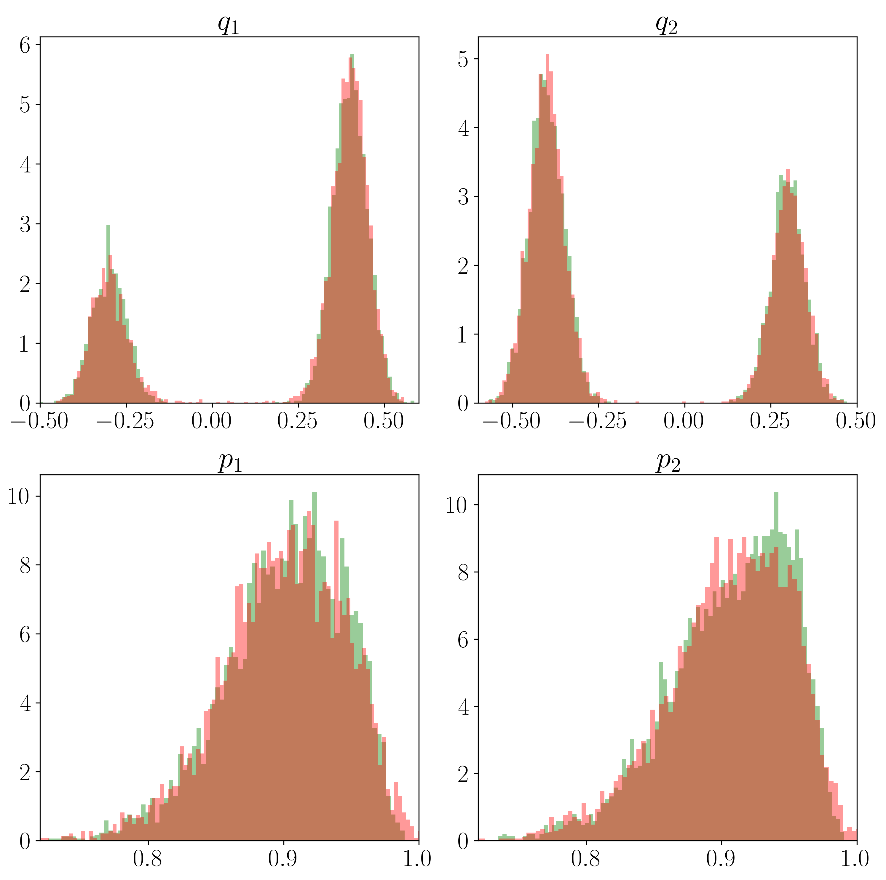

# Results of Further Experiments

## 1. SO(10) under Nonlinear Transformation

<!--  -->

**Figure 1.** Histograms of the statistics tr(S), tr(S^2), tr(S^4) and tr(S^5): Red represents the samples generated by our method; Green represents the target distribution.

The experiment was conducted independently for five times. The Sliced 1-Wasserstein distance between the generated data and the true data is 0.002354(0.000199), respectively (mean $\pm$ standard deviation).

## 2. Conserved Hamiltonian Surface in Phase Space

**Figure 2.** Histograms of $q_1$, $q_2$, $p_1$, and $p_2$: Red represents the samples generated by our method; Green represents the target distribution.

The experiment was conducted independently for five times. The 1-Wasserstein distance between the generated data and the true data is 0.3113 $\pm$ 0.0024, respectively (mean $\pm$ standard deviation).
