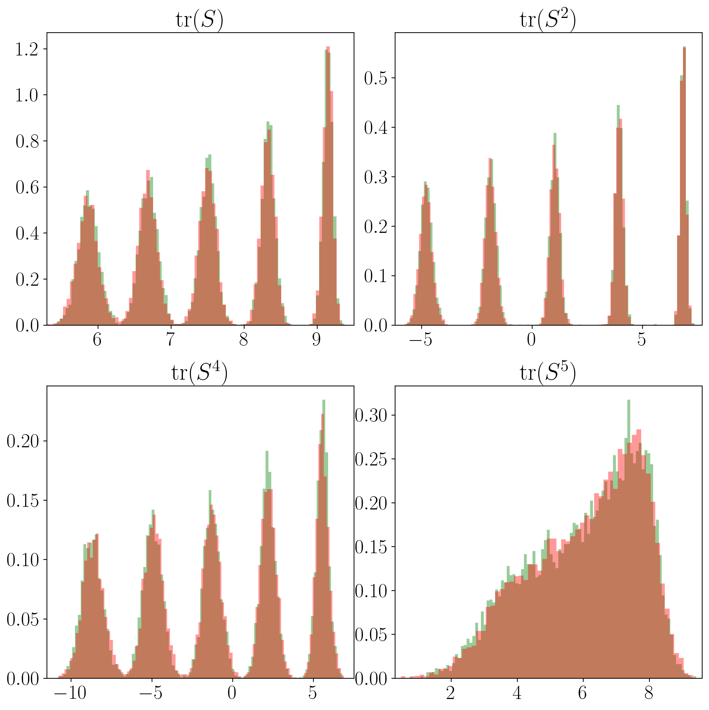

# Results of Further experiments.

## SO(10) under nonlinear transformation

<!--  -->

**Figure 1.** Histograms of the statistics ​tr(S), tr(S^2), tr(S^4) and tr(S^5): Red represents the samples generated by our method; Green represents the target distribution.

We run the experiment five times. The Sliced 1-Wasserstein distance between the generated data and the target distribution is 0.002354(0.000199), respectively (mean $\pm$ standard deviation).

## Conserved Hamiltonian surface in phase space

**Figure 2.** Histograms of $q_1$, $q_2$, $p_1$, and $p_2$: Red represents the samples generated by our method; Green represents the target distribution.

We run the experiment five times. The 1- and 2-Wasserstein distances between the generated data and the target distribution are 0.3113 $\pm$ 0.0024 and 0.3897 $\pm$ 0.0032, respectively (mean $\pm$ standard deviation).
